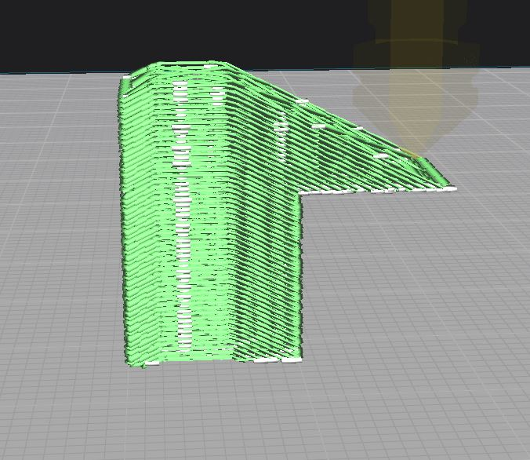
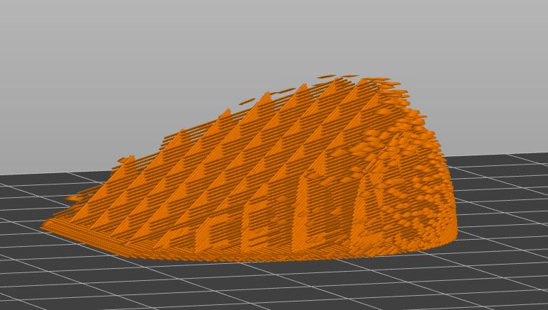
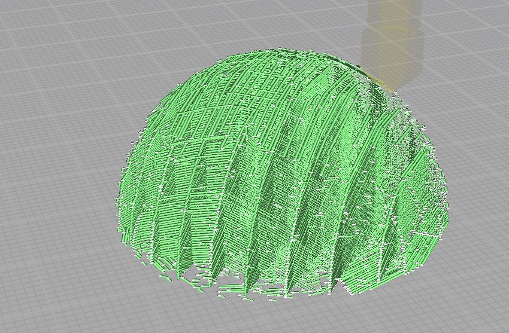

# Non-Plainar-Slicing 

## Introduction
This project is still in its early stage of development, so it is more a proof of concept on how G-code for non-planar printing can be generated. This project enables slicing of G-code for non-planar 3D printing. The G-code allows you to:

- Reduce support structure
- Improve top layer surface finish
- Improve the strength of your part
    
### Generated G-code

  
  
  

## Installation

Follow these steps to set up and run the Non-Plainar-Slicing project.
Prerequisites

Ensure you have the following installed on your machine:

          Python 3.8 or higher
          Git

### Steps
#### 1) Clone the repository:
Open your terminal and run the following command to clone the repository:

         git clone https://github.com/q4yz/Non-Plainar-Slicing.git
         cd None-Plainar-Slicing

#### 2) Set up a virtual environment:
Create a virtual environment to manage your dependencies:

         python -m venv myenv

#### 3) Activate the virtual environment:
On Windows:

         myenv\Scripts\activate

#### 4) Install the required dependencies:
With the virtual environment activated, install the required packages using pip:

         python -m pip install -r requirements.txt

#### 5) Run the main script:
Execute the main script to start the project:

         python NonPlainarSlicing/main.py

#### Notes
Ensure your terminal is in the None-Plainar-Slicing directory when running the commands.
If you encounter any issues related to missing dependencies, make sure all required packages are listed in requirements.txt and installed.

## Usage 

The process involves three main steps:

1. **Preprocessing the Mesh:** Prepare the mesh model for slicing by transforming it.
2. **Slicing the Mesh:** Slice the mesh using any regular slicing technique.
3. **Postprocessing the G-code:** Finalize the G-code for non-planar printing by transforming it back.

### Requirement for the Slicer:

- XYZE coordinates need to be in absolute position.
- The slicer must not generate any toolpaths outside the model, because this can alter the realignment for the backtransformation.
- During slicing, the model can be placed anywhere on the build plate.

---
## License 

This project is licensed under the MIT License.

---
